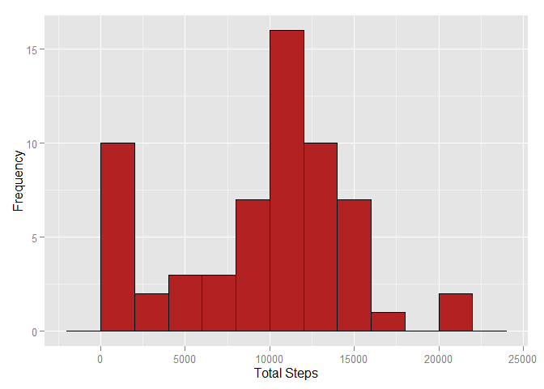
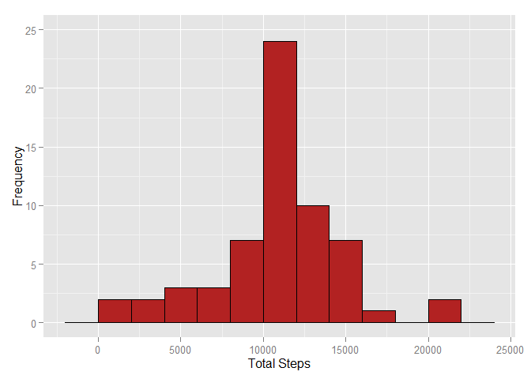
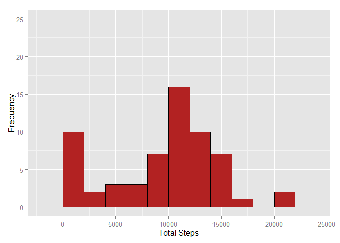
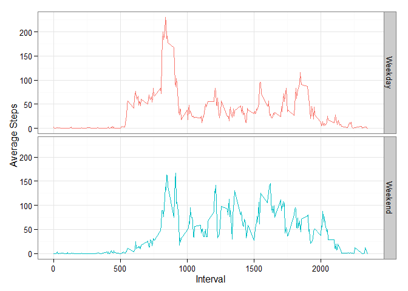
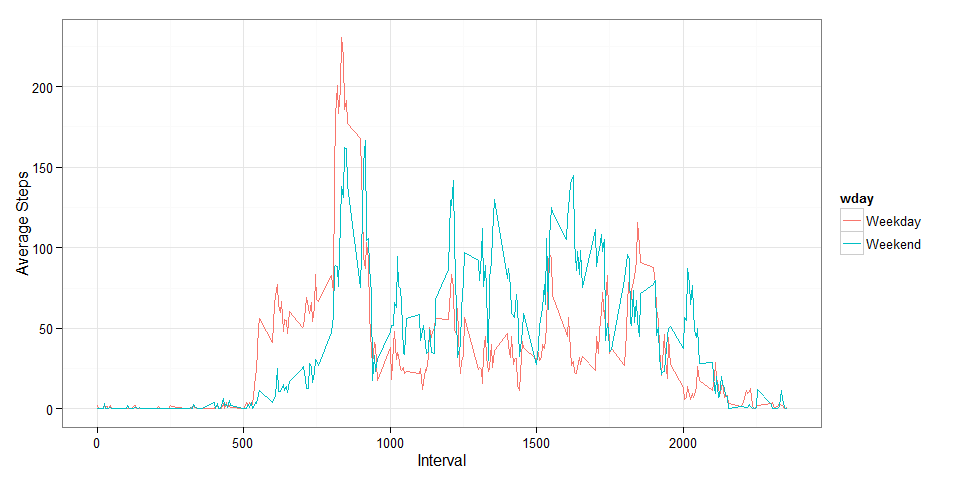

# Reproducible Research: Peer Assessment 1

```r
#setting global options
knitr::opts_chunk$set(echo=TRUE,message=FALSE,warning=FALSE,dev="png")
```

## Loading and preprocessing the data
First of all let us load the data.  

```r
df <- read.csv("activity.csv")
```
   
## What is mean total number of steps taken per day?

To find the total steps per day, let us use the library dplyr to group the data frame by the date.

```r
library(dplyr)  # to manipulate data frames
library(pander) # nice printing in markdown
library(knitr)  # for markdown
panderOptions('table.style', 'rmarkdown') # so that the md file looks okay.
# group the data by date,  then compute the total steps for each date.
sm <- group_by(df,date) %>% summarise(TotalSteps = sum(steps,na.rm=TRUE))
pander(as.data.frame(sm),big.mark=",") # print out the total steps.
```


|    date    |  TotalSteps  |
|:----------:|:------------:|
| 2012-10-01 |      0       |
| 2012-10-02 |     126      |
| 2012-10-03 |    11,352    |
| 2012-10-04 |    12,116    |
| 2012-10-05 |    13,294    |
| 2012-10-06 |    15,420    |
| 2012-10-07 |    11,015    |
| 2012-10-08 |      0       |
| 2012-10-09 |    12,811    |
| 2012-10-10 |    9,900     |
| 2012-10-11 |    10,304    |
| 2012-10-12 |    17,382    |
| 2012-10-13 |    12,426    |
| 2012-10-14 |    15,098    |
| 2012-10-15 |    10,139    |
| 2012-10-16 |    15,084    |
| 2012-10-17 |    13,452    |
| 2012-10-18 |    10,056    |
| 2012-10-19 |    11,829    |
| 2012-10-20 |    10,395    |
| 2012-10-21 |    8,821     |
| 2012-10-22 |    13,460    |
| 2012-10-23 |    8,918     |
| 2012-10-24 |    8,355     |
| 2012-10-25 |    2,492     |
| 2012-10-26 |    6,778     |
| 2012-10-27 |    10,119    |
| 2012-10-28 |    11,458    |
| 2012-10-29 |    5,018     |
| 2012-10-30 |    9,819     |
| 2012-10-31 |    15,414    |
| 2012-11-01 |      0       |
| 2012-11-02 |    10,600    |
| 2012-11-03 |    10,571    |
| 2012-11-04 |      0       |
| 2012-11-05 |    10,439    |
| 2012-11-06 |    8,334     |
| 2012-11-07 |    12,883    |
| 2012-11-08 |    3,219     |
| 2012-11-09 |      0       |
| 2012-11-10 |      0       |
| 2012-11-11 |    12,608    |
| 2012-11-12 |    10,765    |
| 2012-11-13 |    7,336     |
| 2012-11-14 |      0       |
| 2012-11-15 |      41      |
| 2012-11-16 |    5,441     |
| 2012-11-17 |    14,339    |
| 2012-11-18 |    15,110    |
| 2012-11-19 |    8,841     |
| 2012-11-20 |    4,472     |
| 2012-11-21 |    12,787    |
| 2012-11-22 |    20,427    |
| 2012-11-23 |    21,194    |
| 2012-11-24 |    14,478    |
| 2012-11-25 |    11,834    |
| 2012-11-26 |    11,162    |
| 2012-11-27 |    13,646    |
| 2012-11-28 |    10,183    |
| 2012-11-29 |    7,047     |
| 2012-11-30 |      0       |
   
<br><br>    
  

Now let us create a histogram for the total steps each day.  

```r
library(ggplot2)
ggplot(sm,aes(x=TotalSteps)) + geom_histogram(col="black",fill="firebrick",binwidth=2000) + labs(x="Total Steps", y = "Frequency")
```

 
  <br><br>  
  
The mean and median of the total steps walked each day are as follows.  


```r
pander(data.frame( Mean=mean(sm$TotalSteps,na.rm=T),
                   Median=median(sm$TotalSteps,na.rm=T)
                   )
       )
```


|  Mean  |  Median  |
|:------:|:--------:|
|  9354  |  10395   |
    
<br><br>  
    
## What is the average daily activity pattern?
  
To find average daily pattern, we will again group our original data frame, but this time, according to the interval.   

```r
#group data by each interval and then compute average steps.
smi <- group_by(df,interval) %>% summarise(AvSteps=mean(steps,na.rm=T))
```

Now let us create a daily activity plot.   

```r
qplot(interval,AvSteps,data=smi,geom="line") + labs(x="Interval",y="Average Steps")
```

 
  
The interval with the maximum number of average steps across all days is given below.  

```r
as.data.frame(smi[which.max(smi$AvSteps),])
```

```
##   interval  AvSteps
## 1      835 206.1698
```
   
   <br><br>   

## Imputing missing values

Total number of missing values    

```r
sum(!complete.cases(df))
```

```
## [1] 2304
```

Now let us fill in the missing values with the corresponding mean values for the same interval. If we had used the mean of the day, there would still have been NAs, as a number of days did not have even a single non-NA value.   

```r
dfimputed <- df
empty <- !complete.cases(df)  # the vector containing locations of rows with NAs
for(i in 1:nrow(dfimputed)){
     if(empty[i]){ #for each empty, replace with average of corresponding interval
          dfimputed$steps[i] <- smi$AvSteps[which(smi$interval==dfimputed$interval[i])]
     }
}
```

Now again following the previous steps of finding the total number of steps for each day and drawing the histogram.  

```r
#group by date, and then compute total sum for each date.
smimputed <- group_by(dfimputed,date) %>% summarise(TotalSteps=sum(steps))

ggplot(smimputed,aes(x=TotalSteps)) + geom_histogram(col="black",fill="firebrick",binwidth=2000) + labs(x="Total Steps", y = "Frequency") + ylim(0,25)
```

 

In comparison our original graph was  

```r
ggplot(sm,aes(x=TotalSteps)) + geom_histogram(col="black",fill="firebrick",binwidth=2000) + labs(x="Total Steps", y = "Frequency") + ylim(0,25)
```

 

The frequency from the zero bin shifts to the middle bins.

Here is the mean and median of the two.  


```r
#Imputed Data
pander(data.frame( Mean=mean(smimputed$TotalSteps,na.rm=T),
                   Median=median(smimputed$TotalSteps,na.rm=T)
                   )
       )
```


|  Mean  |  Median  |
|:------:|:--------:|
| 10766  |  10766   |

```r
#Original Data
pander(data.frame( Mean=mean(sm$TotalSteps,na.rm=T),
                   Median=median(sm$TotalSteps,na.rm=T)
                   )
       )
```


|  Mean  |  Median  |
|:------:|:--------:|
|  9354  |  10395   |
  
The two estimates are different. The mean and median of the daily imputed data is more than the corresponding parameter of the original daily data. This is likely due to the method of removing NAs, where we used the mean interval values to replace NAs, and are now computing the daywise means.   
The mean and median of the newly imputed data is same somehow.   

## Are there differences in activity patterns between weekdays and weekends?

Let us now compare the activity patterns of weekdays and weekends. To do this, first of all let us create a factor variable that will tell whether a certain day is weekend or weekday.   

```r
dfimputed$date <- as.Date(dfimputed$date)
dfimputed$wday <- ifelse(weekdays(dfimputed$date) %in% c("Saturday","Sunday"),"Weekend","Weekday")
dfimputed$wday <- as.factor(dfimputed$wday)
#group by interval, and then compute average steps for each interval.
wdaysm <- group_by(dfimputed,wday,interval) %>% summarise(AvSteps=mean(steps))
```

Now that the new factor variable has been created, let's create a panel plot to show the difference between the two.   

```r
qplot(interval,AvSteps,data=wdaysm,geom="line",col=wday,facets = wday~.) + theme_bw() + theme(legend.position="none") + labs(x="Interval",y="Average Steps")
```

 
  
  
Or if you want to see the two togther  

```r
qplot(interval,AvSteps,data=wdaysm,geom="line",col=wday) + theme_bw() + labs(x="Interval",y="Average Steps")
```

 
